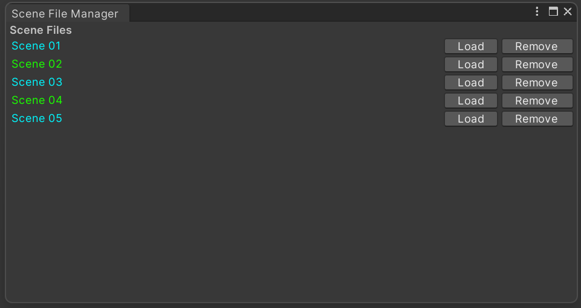

# Some Unity Editor Tools That i Use on daily Basis
# Installation
For now Just Download the project and add the folders to your unity project.

# Package Content
## Scene File Manager
A handy little window to add your most used scene file in there and load them whithout the need to go through different folders each time.

## Batch Renamer
An editor window inspired by c4d rename tool to batch rename files.

https://github-production-user-asset-6210df.s3.amazonaws.com/28543853/270393261-b25717ee-ae03-45e7-83eb-d82695fa80cf.mp4

